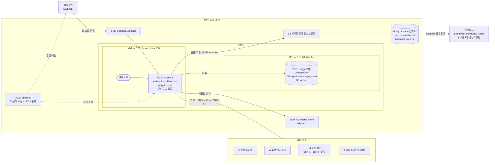

# AWS 저장 계층 설계

## 상태

| 항목 | 내용 |
|---|---|
| 상태 | 초안. 10차 미팅 안건 |
| 기준일 | 10월 4일 |
| 담당 | PM(대현) |
| 리뷰 | 데이터 엔지니어링·인프라(주영) |
| 입력 | 9월 30일 저장 계층 계획서 초안, 10월 4일 PM 확인 결과, ERD v2.2(Signal-Pipeline-Design 저장소 `docs/#42-erd-v2.2` 브랜치, PR #43) |
| 다음 단계 | DB 프로비저닝(10월 8일~14일), 데이터 파이프라인 Flow·아키텍처 초안(10월 8일경)이 이 문서를 전제로 함 |

- 가격 중 AWS 공식 문서로 확인한 값은 공인 IPv4 요금 하나뿐. 나머지 가격과 무료 요금제 제한은 「추정」으로 표시
- 단가를 확인하지 않은 요금(EBS 볼륨, RDS 저장 공간, 데이터 전송, 백업 저장 공간)은 비용 표에 「미확인」 행으로 두고 합계에서 뺌. 「미결」

## 1. 요약

- 권고 구성
  - 서울 리전 VPC 하나에 EC2 t4g.small 1대를 상시 실행. 이 서버에서 Airflow(LocalExecutor), poppler(`pdftotext`), curl 수집을 모두 실행
  - EC2에 탄력적 IP 1개를 붙여 금감원 법인 키의 요청 IP로 등록. NAT 게이트웨이는 두지 않음
  - DB는 RDS PostgreSQL db.t4g.micro 단일 AZ. 사설 서브넷에 두고 EC2에서만 접속. Airflow 메타데이터 DB도 같은 인스턴스의 별도 데이터베이스로 둠
  - 원문은 S3 버킷 하나에 `raw/`, `derived/`, `runs/` 접두어로 저장. 경로는 원본 보관 규칙 문서의 `RAW_ROOT` 상대경로를 그대로 객체 키로 씀. 버전 관리와 덮어쓰기 금지 정책으로 원본 불변을 보장
  - ERD v2.2 표 17개를 PostgreSQL 스키마 `raw`(5개), `staging`(9개), `mart`(3개)에 배치
- 월 비용(추정): 권고안 확인된 항목 기준 약 37달러 + 미확인 항목(EBS, RDS 저장, 백업, 전송), 최소안(EC2 1대에 PostgreSQL 포함, 하루 4시간만 실행) 약 6.36달러
- 10월 8일~12월 31일 누적(추정): 권고안 약 104.28달러. 크레딧 200달러를 다 받으면 범위 안, 가입 크레딧 100달러만 있으면 12월 말에 소진
- 월 상한 50달러(10월 4일 확정). 단가 확인 전 잠정으로 권고안을 기본 구성으로 둠
- 크레딧 소진은 무료 요금제 종료와 계정 폐쇄로 이어지므로, 결제 주체 PM(대현)이 크레딧 잔액 40달러 이하가 되기 전에 유료 요금제로 전환

## 2. 확정 조건과 입력 수치

### 확정 조건

| 조건 | 내용 | 확정일 |
|---|---|---|
| CSP | AWS 서울 리전(ap-northeast-2) | 9월 30일 |
| 비용 | 비용 지원 없음. 상시 서버를 최소로 둠 | 9월 30일 |
| 오케스트레이션 | Airflow 사용 | 9월 2일 |
| 결제 주체 | PM(대현). 크레딧 소진 뒤 유료 전환과 결제도 PM 계정 | 10월 4일 |
| 월 상한 | 50달러. AWS Budgets 알림 25·40·50달러 3단계 | 10월 4일 |
| 프로젝트 종료 | 2026년 12월 | - |

### 데이터 규모

| 항목 | 값 | 근거 |
|---|---|---|
| DART 투자설명서 PDF 평균 크기 | 1.07MB | 9건 실측 |
| DART 대상 건수 | 약 6,500건 | 추정. 9월 30일 저장 계층 계획서 기준 |
| DART 원본 합계 | 약 7GB | 위 두 값의 곱 |
| 추출 텍스트 합계 | 약 1.6GB | 10월 4일 PM 실측: DART 9건 pdftotext 결과 평균 243KB × 약 6,500건 |
| 금투협 원본 | 연 약 250GB | 추정, 미측정. 9월 23일 ERD v2 검토의 cloud 관점 추정([2단계 데이터 파이프라인 Flow 설계 입력](https://github.com/BOAZ-Signal-Team-26/Signal-Pipeline-Design/blob/main/docs/pipeline-flow.md) 「cloud 관점」). Phase 1 포함 여부 미정(결정 대기 D: 금투협 자료를 Phase 1 수집 범위에 넣을지에 대한 팀 결정) |
| 전량 재실행 1회 DB 행 수 | 약 8M행, 5~10GB | 추정, ERD v2.1 기준 산정([2단계 데이터 파이프라인 Flow 설계 입력](https://github.com/BOAZ-Signal-Team-26/Signal-Pipeline-Design/blob/main/docs/pipeline-flow.md) 「cloud 관점」) |

### AWS 계정 조건

- 신규 계정 크레딧: 가입 시 100달러 + 활동 5개 수행 시 최대 100달러, 합계 최대 200달러
- 무료 요금제는 가입 6개월 경과 또는 크레딧 소진 중 먼저 오는 시점에 종료
  - 종료 시 유료 요금제로 전환하지 않으면 계정이 자동 폐쇄되고 90일 뒤 삭제됨. S3 원문, RDS, 탄력적 IP 모두 함께 사라짐
  - 유료로 전환하면 계정과 자원이 유지됨
- 무료 요금제 인스턴스 제한(추정, 2차 출처): t3.small·t4g.small까지 사용 가능, t3.medium 불가

### 가격

| 항목 | 단가 | 월 환산(730시간) | 출처 |
|---|---|---|---|
| 공인 IPv4(탄력적 IP 포함) | 0.005달러/시간 | 3.65달러 | 공식 |
| EC2 t4g.small | 0.0208달러/시간 | 15.18달러 | 추정 |
| EC2 t3.small | 0.026달러/시간 | 18.98달러 | 추정 |
| EC2 t3.medium | 0.052달러/시간 | 37.96달러 | 추정 |
| RDS db.t4g.micro | 약 0.025달러/시간 | 18.25달러 | 추정 |
| NAT 게이트웨이 | 약 0.059달러/시간 | 43.07달러 | 추정. 처리 데이터 요금 별도 |
| S3 Standard | 0.025달러/GB월 | DART 8.6GB 기준 0.22달러 | 추정 |

### 9월 30일 계획서의 결정 항목과 이 문서의 절

| 결정 항목 | 절 |
|---|---|
| CSP·호스팅 | 2(확정 조건), 3.3 |
| DB 제품 | 3.1 |
| 원문 저장소 | 3.2 |
| 3계층 정의와 ERD 표 대응 | 3.6 |
| Airflow 실행 위치 | 3.3 |
| 백업 범위 | 3.7 |
| 고정 IP 확보(추가) | 3.4 |
| PDF 처리(poppler·curl) 실행 위치(추가) | 3.5 |

## 3. 결정 항목

### 3.1 DB 제품과 위치

| 선택지 | 월 비용(추정) | 운영 부담 | 위험 |
|---|---|---|---|
| A. RDS PostgreSQL db.t4g.micro, 단일 AZ | 18.25달러 + 저장 공간(단가 미확인) | 낮음. 자동 백업·패치·시점 복구를 AWS가 처리 | 메모리가 작아 큰 조인·정렬이 느릴 수 있음. 무료 요금제에서 사용 가능한지 공식 확인 필요 |
| B. EC2 안 Docker PostgreSQL | 0달러(EC2 비용에 포함) | 높음. 백업 스크립트·업그레이드·디스크 관리를 직접 함 | t4g.small 메모리 2GB를 Airflow·pdftotext와 나눠 써서 메모리 부족 시 DB까지 함께 멈춤. EC2를 끄면 대시보드도 DB를 못 읽음 |
| C. RDS Multi-AZ | 단일 AZ의 약 2배(추정) | 낮음 | 비용 대비 이득 없음. 12월 종료 프로젝트에 가용성 요구가 없음 |

권고: A

- 근거
  - 이 프로젝트의 DB 위험은 가용성보다 데이터 유실이다. RDS 자동 백업이 이 위험을 직접 줄이고, B는 같은 수준을 맞추려면 백업 스크립트를 따로 만들어야 함
  - DB를 EC2와 분리하면 EC2를 켜고 끌 수 있음(3.3). 대시보드가 DB를 읽는 경우 DB만 켜 두면 됨
  - 전량 재실행 1회 5~10GB(추정)는 db.t4g.micro로 처리 가능한 규모. 느리면 인스턴스 크기만 올림
- 설정
  - PostgreSQL 주 버전은 프로비저닝 시점의 RDS 기본 최신 주 버전
  - 공개 접근 끔(publicly accessible = false). 사설 서브넷 2개(ap-northeast-2a, 2c)로 DB 서브넷 그룹 구성(RDS 필수 조건)
  - 데이터베이스 2개: `signal`(ERD 표), `airflow`(Airflow 메타데이터)
  - 저장 공간 자동 확장 상한을 둠. 상한 값은 저장 단가 확인 후 정함
- 비용이 더 급하면 B로 내려가는 최소안을 4절에 둠

### 3.2 원문 저장소(S3)

#### 버킷 구조

| 선택지 | 비용 | 운영 부담 | 위험 |
|---|---|---|---|
| A. 버킷 1개 + 접두어 `raw/`, `derived/`, `runs/` | 같음 | 낮음. 정책 1개 | 접두어별 권한을 정책에서 정확히 나눠야 함 |
| B. 계층별 버킷 3개 | 같음 | 중간. 버킷마다 정책·수명 주기·Terraform 자원 | 원본 보관 규칙의 `RAW_ROOT`(세 디렉터리를 포함한 공통 루트)와 어긋남 |
| C. EC2 EBS 볼륨에 파일로 저장 | EBS 단가 미확인 | 중간. 볼륨 크기·스냅숏 관리 | EC2 장애 시 원본까지 영향. 4인이 직접 열람하기 어려움 |

권고: A

- 버킷 이름: `signal-data-{접미어}`. S3 버킷 이름은 전 세계에서 유일해야 하므로 계정 생성 후 접미어를 정함
- `RAW_ROOT` = `s3://signal-data-{접미어}/`. DB의 `storage_path`와 각종 `*_manifest_path`는 이 루트 기준 상대경로이며 그대로 S3 객체 키가 됨
- 객체 키 형식은 [원본 보관과 수집·파싱 실패 처리 규칙](https://github.com/BOAZ-Signal-Team-26/Signal-Pipeline-Design/blob/main/docs/storage-and-failure-rules.md) 「파일 경로」「파생 텍스트·실행 스냅숏 경로」를 따름

```text
s3://signal-data-{접미어}/
  raw/{source}/{collected_date}/{object_key_hash}/{file_role}__v{version_seq}.{ext}
  raw/{source}/{collected_date}/{object_key_hash}/{file_role}__v{version_seq}.{ext}.meta.json
  derived/{raw_sha256}/{parser_version}/text.txt
  derived/{raw_sha256}/{parser_version}/structure.json
  runs/{run_id}/inputs.json
  runs/{score_run_id}/selection.json
  runs/{score_run_id}/populations/{population_snapshot_id}.json
  backups/postgres/{YYYY-MM-DD}/signal.dump      # 이 문서에서 추가(3.7)
  exports/{score_run_id}/...                     # 대시보드 결정에 따라 추가(3.9)
```

- `backups/`, `exports/`는 원본 보관 규칙 문서에 없는 접두어. `storage_path`로 참조하지 않는 운영용 위치
- 평가 자료(축 4 사건 단위 검증 자료 등)의 접근 분리는 원본 보관 규칙 문서에서 미결(검토 번호 B4: ERD v2 검토에서 붙인 「평가 자료 접근 분리」 항목 번호). 분리로 정해지면 별도 버킷을 하나 추가

#### 원본 불변 보장

| 선택지 | 비용 | 운영 부담 | 위험 |
|---|---|---|---|
| A. 버전 관리 + 버킷 정책으로 `raw/`·`runs/` 삭제 금지 + 조건부 쓰기 강제 | 덮어쓴 이전 버전만큼 저장 비용 | 낮음 | 관리자 권한을 가진 사람은 정책을 고칠 수 있음 |
| B. A + Object Lock 거버넌스 모드 | A와 같음 | 중간. 버킷 생성 시에만 켤 수 있음 | 특별 권한으로 해제 가능하므로 실수 방지 수준 |
| C. A + Object Lock 규정 준수 모드 | A와 같음 | 높음 | 보존 기간 동안 루트 계정도 삭제 불가. 프로젝트 종료 후 정리가 막힘 |

권고: A

- 근거
  - 원본 보관 규칙은 「같은 바이트면 새 버전을 만들지 않고, 다르면 `version_seq`를 늘려 새 키에 저장」이므로 정상 동작에서는 같은 키에 두 번 쓰는 일이 없음. 막을 대상은 코드 오류와 사람의 실수
  - 코드 오류는 조건부 쓰기(키가 없을 때만 저장, `If-None-Match: *`)로 막음
  - 사람의 실수는 버전 관리로 복구. 삭제해도 이전 버전이 남음
  - 4인 학생 프로젝트에서 Object Lock의 추가 보호는 이득이 작고, 규정 준수 모드는 종료 후 정리를 막음
- 접두어별 쓰기 규칙

| 접두어 | 쓰기 | 이유 |
|---|---|---|
| `raw/` | 조건부 쓰기만 허용. 덮어쓰기 금지 | 원본 바이트 불변 |
| `runs/` | 조건부 쓰기만 허용. 덮어쓰기 금지 | 완료된 manifest 불변 |
| `derived/` | 조건 없는 쓰기 허용 | 원본 보관 규칙상 EXTRACT_FAILED·EXTRACT_PARTIAL 결과는 다음 실행이 같은 키(원본 파일 × 파서 버전)에 덮어씀. 이전 내용은 버전 관리로 남고 수명 주기로 30일 뒤 삭제 |

- 이미 있는 키에 조건부 쓰기가 실패했을 때의 처리
  - 본체 파일과 `.meta.json`은 따로 올리므로 한쪽만 올라간 상태가 생길 수 있음(두 파일 쓰기는 원자적이지 않음)
  - 규칙: 같은 키가 이미 있고 저장된 객체의 SHA-256이 올리려던 바이트와 같으면 성공으로 처리. 다르면 실패로 기록하고 중단
  - 이 규칙으로 본체만 올라간 뒤 중단된 작업을 다시 실행해도 `.meta.json`까지 이어서 올릴 수 있음
- 설정
  - 버전 관리(versioning) 켬
  - 버킷 정책: 파이프라인 역할과 사람 계정 모두 `raw/*`, `runs/*`에 `s3:DeleteObject`, `s3:DeleteObjectVersion` 거부
  - 버킷 정책: `raw/*`, `runs/*`에 조건(`If-None-Match`) 없는 `s3:PutObject` 거부. 정책에 쓸 조건 키 이름은 구현 때 AWS 공식 문서로 확인
  - 종료 시 정리 순서는 6절 「프로젝트 종료 절차」
  - 공개 접근 차단(Block Public Access) 4개 항목 모두 켬
  - 기본 암호화: S3 관리형 키(SSE-S3)

#### 수명 주기

| 접두어 | 규칙 | 이유 |
|---|---|---|
| `raw/` | 만료 없음. Standard 유지 | 재수집으로 같은 바이트를 얻는다는 보장이 없음(3.7). 용량이 작아 저장 등급 이동 이득이 작음(다른 등급 단가 미확인) |
| `derived/` | 이전 버전 30일 뒤 삭제 | 원본과 파서 버전으로 다시 만들 수 있음 |
| `runs/` | 만료 없음 | 공식 채점 실행의 입력 고정 기록. 완료 후 불변 |
| `backups/` | 35일 뒤 삭제 | 주 1회 덤프 5개 유지 |
| 버킷 전체 | 완료되지 않은 멀티파트 업로드 7일 뒤 삭제 | 실패한 업로드의 조각이 남아 요금이 나가는 것을 막음 |

- 금투협이 Phase 1에 들어오면(결정 대기 D) 월 약 20.8GB씩 늘어남(추정). 12월 말 약 62.5GB, 월 1.56달러(추정). 그때도 저장 등급 이동은 하지 않음

### 3.3 Airflow 실행 위치와 켜고 끄는 방식

| 선택지 | 월 비용(추정) | 운영 부담 | 위험 |
|---|---|---|---|
| A. EC2 t4g.small 상시, LocalExecutor 최소 구성 + 스왑 | 15.18달러 | 낮음 | 메모리 2GB. 동시 작업 수를 낮게 묶어야 함 |
| B. EC2 t3.small 상시 | 18.98달러 | 낮음 | A와 같은 메모리. x86이라 패키지 호환 걱정이 없음 |
| C. A를 EventBridge Scheduler로 수집 시간에만 켜고 끔(하루 4시간 가정) | 2.50달러 | 중간. 시작 시 Airflow 자동 기동, 끄기 전 실행 중 작업 확인 | 꺼진 동안 Airflow 화면과 스케줄이 멈춤. 개발 기간에 불편 |
| D. EC2 t3.medium(4GB) | 37.96달러 | 낮음 | 무료 요금제에서 사용 불가(추정). 비용 2배 |
| E. Amazon MWAA(관리형 Airflow) | 단가 미확인 | 낮음 | 상시 과금 구조로 알려져 있어 이 예산에 맞지 않을 가능성이 큼. 미확인 |

권고: A로 시작. 크레딧이 부족해지면 C로 전환

- 근거
  - 10월~11월은 DAG 개발 기간이라 Airflow 화면을 수시로 씀. 켜고 끄는 방식은 월 약 12.68달러를 아끼지만 개발 속도를 늦춤
  - t4g(ARM)는 t3보다 시간당 약 20% 쌈. 문제가 있으면 B로 바꿈(인스턴스 종류만 바꾸면 됨)
  - DB를 RDS로 분리했으므로 EC2를 꺼도 DB와 대시보드는 영향을 받지 않음
- Airflow 버전: 2.x 최신 부 버전, LocalExecutor. 설치 시 Airflow 공식 제약 파일(constraints)로 의존성 버전까지 고정
  - 3.x는 화면·API 서버(api-server), DAG 파일 해석기(dag-processor), 스케줄러(scheduler)가 각각 별도 프로세스로 떠서 2GB를 넘을 위험이 큼
  - 2.x는 웹 서버와 스케줄러 2개 프로세스. DAG 해석은 스케줄러 안에서 함
  - 2.x 계열의 보안 수정 지원이 12월까지 유지되는지는 확인 필요(「미결」)
- 2GB 메모리 안에서 돌리기 위한 설정
  - 공식 docker-compose 예시는 Celery·Redis 컨테이너를 함께 띄우므로 그대로 쓰지 않음
  - 메타데이터 DB: RDS의 `airflow` 데이터베이스. EC2에 PostgreSQL을 띄우지 않음
  - 전체 동시 작업 수(parallelism) 2, DAG당 동시 작업 수(max_active_tasks_per_dag) 2
  - 스왑 파일 2GB를 루트 볼륨에 만듦. 메모리 부족 시 프로세스가 강제 종료되는 대신 느려짐
  - `pdftotext`는 작업 안에서 하위 프로세스로 한 번에 1개씩 실행
- 10월 8일 실측과 합격 기준(제안)
  - 유휴 상태(웹 서버·스케줄러만 실행, DAG 실행 없음)의 사용 메모리 1.2GB 이하, 스왑 사용 0
  - DART PDF 1건 처리 중 스왑 사용 500MB 이하
  - 기준을 넘으면 설정을 더 줄이지 않고 바로 t3.small(x86)로 전환. 같은 2GB이므로 메모리 문제는 그대로 남고, 그때는 3.3 D(t3.medium)를 유료 전환과 함께 검토
- ARM(arm64) 위험
  - HWP 처리: 분쟁조정결정례 첨부가 HWP. 현재 조사 스크립트(`hwp_text.py`)는 표준 라이브러리만 쓰지만 이후 외부 HWP 도구를 쓰면 arm64 빌드가 없을 수 있음
  - arm64용 미리 빌드된 패키지(wheel)가 없는 Python 의존성은 설치 중 소스 빌드가 필요하고 2GB에서 실패할 수 있음
  - 대응: 구축 첫 단계에서 arm64 인스턴스에 `pip install --dry-run`으로 팀 의존성 전체를 검증(6절). 실패하면 t3.small로 시작
- 파서 버전 규칙
  - `file_extraction.parser_version`에 poppler 버전을 포함(형식 예: `pdftotext-{poppler 버전}-p{전처리 버전}`). 형식은 ERD 적재 검증 규칙 17(소문자·숫자·`.`·`-`·`_`만)을 따름
  - 이유: CPU 아키텍처나 poppler 버전이 바뀌면 같은 PDF의 `pdftotext` 출력이 달라질 수 있음. 버전이 키에 없으면 다른 출력이 같은 `derived/` 경로를 차지함
  - t4g에서 t3로 바꾸는 경우도 poppler 버전이 달라지면 새 파서 버전으로 다시 추출
- C로 전환할 때
  - EventBridge Scheduler 일정 2개: EC2 시작, EC2 중지
  - 탄력적 IP는 인스턴스를 껐다 켜도 그대로 유지되므로 금감원 IP 등록에 영향 없음
  - 인스턴스가 꺼진 동안 지나간 스케줄을 켤 때 몰아서 실행하지 않도록 지난 실행 보충(catchup)을 끔
  - 무료 요금제에서 EventBridge Scheduler를 쓸 수 있는지 확인 필요(「미결」)

### 3.4 고정 IP(금감원 법인 키)

- 금감원 법인 키는 요청 IP 등록이 필요함. 수집 서버 IP가 정해지기 전에 신청하면 재신청 필요([데이터 소스 수집 명세](https://github.com/BOAZ-Signal-Team-26/Signal-Pipeline-Design/blob/main/docs/data-sources.md) 「금감원」)

| 선택지 | 월 비용(추정) | 운영 부담 | 위험 |
|---|---|---|---|
| A. 공개 서브넷의 EC2에 탄력적 IP 1개 | 3.65달러(공식 단가) | 낮음 | EC2가 공개 서브넷에 있음. 보안 그룹 인바운드를 모두 닫아 대응(3.8) |
| B. 사설 서브넷 EC2 + NAT 게이트웨이(탄력적 IP 포함) | 약 46.72달러 + 처리 데이터 요금 | 중간 | 비용이 권고안 전체보다 큼 |

권고: A

- 근거: 같은 고정 IP를 B의 약 13분의 1 비용으로 얻음. 인바운드를 열지 않으면 공개 서브넷이라는 차이가 공격 면을 늘리지 않음
- 순서: 탄력적 IP 할당 → EC2에 연결 → 그 IP로 금감원 법인 키 신청
- 위험
  - 탄력적 IP를 해제하면 같은 주소를 다시 받을 수 없음. Terraform 탄력적 IP 자원에 삭제 방지(`lifecycle { prevent_destroy = true }`)를 둠
  - 탄력적 IP 할당 자원과 인스턴스 연결 자원을 분리해 둠. 인스턴스를 교체해도 IP 자원은 그대로이고 연결만 새 인스턴스로 바뀜
  - 인스턴스 교체 절차: 새 인스턴스 생성 → 탄력적 IP 연결을 새 인스턴스로 옮김 → 새 인스턴스에서 공인 IP 확인(`curl` 등으로 출구 IP 조회) → 금감원 API 시험 호출 → 이전 인스턴스 삭제
  - 계정이 폐쇄되면 IP도 사라지고 법인 키 재신청이 필요함(3.10)
  - 탄력적 IP는 인스턴스에 붙어 있든 아니든 같은 요금이 나감(공인 IPv4 요금)
- RDS에는 공인 IP를 붙이지 않음. 추가 IPv4 요금도 없음

### 3.5 PDF 처리(poppler·curl) 실행 위치

| 선택지 | 비용 | 운영 부담 | 위험 |
|---|---|---|---|
| A. Airflow와 같은 EC2 안 | 추가 없음 | 낮음. 패키지 설치 1회 | 메모리를 Airflow와 나눔. 동시 1개로 제한 |
| B. Lambda 컨테이너 이미지 | 단가 미확인 | 높음. 이미지 빌드·ECR·VPC 안 RDS 접속 설정 | VPC 안 Lambda가 인터넷이나 S3에 닿으려면 NAT 게이트웨이나 VPC 엔드포인트가 추가로 필요. 출구 IP가 고정되지 않아 수집(curl)은 옮길 수 없음 |

권고: A

- 근거
  - 6,500건, 약 7GB는 EC2 한 대에서 순차 처리할 수 있는 양. 처리 시간은 구축 때 실측
  - 금투협 수집은 curl로 해야 하고(Python `urllib`는 응답이 중간에 잘림), 금감원 수집은 고정 IP가 필요하므로 수집은 어차피 EC2에서 돌아야 함. 한 곳에 모으면 배포 대상이 하나
- 설치 대상: `poppler-utils`(`pdftotext` 포함), `curl`. 패키지 목록은 Signal-Pipeline-Design 저장소 [2단계 데이터 파이프라인 Flow 설계 입력](https://github.com/BOAZ-Signal-Team-26/Signal-Pipeline-Design/blob/main/docs/pipeline-flow.md) 「실행 환경 요구」와 맞춤
- 처리 흐름: S3 `raw/`에서 임시 디렉터리로 내려받기 → `pdftotext` → `derived/`에 올리기 → DB `file_extraction` 기록 → 임시 파일 삭제
- 금투협이 들어와 처리량이 크게 늘면 그때 B를 다시 검토

### 3.6 3계층(PostgreSQL 스키마)과 ERD v2.2 표 배치

#### 계층 정의

| 스키마 | 정의 | 쓰는 단계 |
|---|---|---|
| `raw` | 원천에서 받은 사실과 실행 기록. 원천 키로 식별하고 해석 규칙을 적용하지 않음 | 수집 |
| `staging` | 원천을 해석·정규화·매칭한 결과. 마스터, 추출, 절, 매칭 | 추출·매칭 |
| `mart` | 채점 결과와 지표 정의. 대시보드가 읽는 계층 | 채점 |

#### 표 배치(17개)

| 스키마 | 표 | 이 계층에 둔 이유 |
|---|---|---|
| raw | pipeline_run | 수집 시작 시 run_id를 발급. 모든 계층이 참조 |
| raw | collection_attempt | 요청 한 번의 기록 |
| raw | raw_object | 저장한 바이트 한 버전 |
| raw | document | 소스 안의 공고·접수·게시글 하나. raw_object가 참조하므로 같은 계층 |
| raw | source_watermark | 소스별 수집 완료 범위 |
| staging | distributor | 법인 마스터 |
| staging | fund_group | 펀드 묶음과 fund_key |
| staging | product | 상품 클래스 마스터 |
| staging | product_distributor | 상품 × 판매사 × 월 |
| staging | document_product | 문서 × 상품 매칭 결과 |
| staging | match_failure | 매칭 실패 기록 |
| staging | file_extraction | 원본 파일 × 파서 버전 추출 결과 |
| staging | section | 추출 텍스트 안의 절 |
| staging | llm_field_extraction | LLM 필드 추출 결과 |
| mart | metric_definition | 지표 정의 버전 |
| mart | population_snapshot | 채점 실행의 비교 층 |
| mart | score | 채점 결과 |

- 합계: raw 5 + staging 9 + mart 3 = 17
- 참조 방향은 `mart → staging → raw`. 외래 키는 같은 계층이나 아래 계층만 가리킴
- 예외 처리: ERD v2.2의 `document.distributor_id → distributor` 외래 키 1건은 `raw`에서 `staging`을 가리키므로 DB 외래 키로 만들지 않음
  - 대신 적재 검증으로 확인: `document.distributor_id`가 NULL이 아니면 `staging.distributor`에 같은 값이 있어야 함. 어긋난 행은 적재 실패로 기록
  - 이유: 외래 키를 두면 `raw` 스키마만 따로 덤프·복원할 수 없음. `raw`는 원천 사실이라 단독 복원이 가능해야 하위 계층을 다시 만들 수 있음
  - ERD v2.2와 다른 판단이므로 ERD 반영 여부는 「미결」
- 결정 대기 A(analysis_target 병합)가 반대로 정해지면 analysis_target을 `mart`에 추가. 연기한 표 4개(score_dependency, evaluation_run, evaluation_response, analysis_target_member)도 추가 시 `mart`. 평가 표의 접근 분리(B4)가 정해지면 `eval` 스키마를 따로 둘 수 있음
- 대시보드 읽기 뷰(검토 번호 B5, 예: 공식·승인 점수만 보이는 `score_current`)는 `mart`에 둠

#### 단일 스키마 + 뷰 대안과 비교

| 선택지 | 장점 | 단점 |
|---|---|---|
| A. 스키마 3개(`raw`, `staging`, `mart`) | 대시보드 계정에 `mart` 사용 권한만 주면 됨. 표가 어느 단계 소유인지 이름에서 보임 | 마이그레이션 도구와 연결 설정에 검색 경로(search_path) 지정이 필요. 외래 키 1개를 적재 검증으로 대체 |
| B. 스키마 1개(`public`) + 대시보드용 뷰 | 설정이 가장 단순 | 권한을 표·뷰마다 따로 줘야 함. 계층 구분은 문서에만 남음 |

권고: A

- 근거: 대시보드 계정 권한 분리가 실제로 필요한 유일한 요구이고, 스키마 단위 권한이 표 단위 권한보다 실수가 적음. PostgreSQL 뷰는 기본적으로 뷰 소유자 권한으로 실행되므로 `mart` 뷰가 `staging` 표를 조인해도 대시보드 계정에 `staging` 권한을 줄 필요가 없음
- DB 계정
  - `signal_owner`: 스키마·표 소유. 마이그레이션 전용
  - `signal_pipeline`: Airflow가 씀. 세 스키마 읽기·쓰기
  - `signal_reader`: 대시보드와 분석용. `mart` 읽기 전용
  - `airflow`: `airflow` 데이터베이스 전용

### 3.7 백업 범위

#### RDS

- 자동 백업 보관 기간 7일. 그 기간 안의 시점으로 복구 가능
- 주 1회 `pg_dump`(사용자 지정 형식)를 S3 `backups/postgres/`에 저장, 35일 보관. 자동 백업은 계정과 함께 사라지고 다른 계정·다른 DB 제품으로 옮길 수 없으므로 이식 가능한 덤프를 따로 둠
- 백업 저장 요금은 단가 미확인(「미결」)

#### S3

- `raw/`는 불변이고 버전 관리가 켜져 있어 삭제·덮어쓰기에서 복구 가능. 다른 리전 복제는 하지 않음(비용 대비 위험이 작음)
- 재수집 가능 범위

| 자료 | 다시 만들 수 있는가 | 이유 |
|---|---|---|
| `derived/` | 예 | 원본 바이트 + 파서 버전으로 다시 추출 |
| DART 원본 | 일부 | 접수번호로 다시 받을 수 있으나 정정·첨부 교체 후 같은 바이트라는 보장이 없음 |
| 금투협 원본 | 일부 | 같은 공고의 같은 파일명이 항상 불변이라고 가정하지 않음(원본 보관 규칙) |
| 금감원 제재 원본 | 불확실 | API가 과거를 얼마나 제공하는지 확인되지 않음 |
| KRX 일별 원본 | 아니오 | 그날의 전체 목록 스냅숏 |
| `runs/` manifest | 아니오 | 공식 채점 실행의 입력 고정 기록 |

#### 재생성 불가 자산(유실 시 복구 불가, 백업 필수)

- S3 `raw/` 전체와 `runs/` 전체
- DB 표: `pipeline_run`, `collection_attempt`, `source_watermark`(과거 요청·수집 범위 기록), `metric_definition`(승인 이력), `llm_field_extraction`(다시 돌리면 결과가 달라지고 토큰 비용이 듦)
- 사람이 만든 자료: KRX 매칭 실패 229건 수동 매핑 결과, 제재 사례 매핑표, 대조군 문서 목록, 두 명 독립 판정 결과(저장 위치 미정, B4)
- 비밀값(API 키). SSM에만 두고, 원본 발급처에서 재발급 가능한지 키별로 기록

#### 계정 폐쇄 대비

- 무료 요금제가 끝난 뒤 유료로 전환하지 않으면 계정이 폐쇄되고 90일 뒤 위 자산이 모두 삭제됨
- 대비: 매월 말 `pg_dump` 1개와 `runs/` 전체를 AWS 밖 보관처에 복사. 보관처는 「미결」

### 3.8 접근 권한과 비밀값

#### 네트워크

| 대상 | 인바운드 | 아웃바운드 |
|---|---|---|
| EC2 보안 그룹 | 없음(SSH 22번도 열지 않음) | 전체 허용(수집·SSM·S3) |
| RDS 보안 그룹 | 5432번, EC2 보안 그룹에서만 | 기본값 |

#### 4인 접속 방법

| 선택지 | 운영 부담 | 위험 |
|---|---|---|
| A. SSM Session Manager | 낮음. 키 파일 배포 없음. 접속 기록이 남음 | 각자 로컬에 AWS CLI와 Session Manager 플러그인 설치 필요 |
| B. 보안 그룹에 4인 IP 등록 + SSH 키 | 중간. 집·학교 IP가 바뀔 때마다 규칙 수정 | 22번 포트 공개, 키 파일 유출 위험 |

권고: A

- 셸 접속: Session Manager 세션
- Airflow 화면: Session Manager 포트 전달로 로컬 `localhost:8080`에 연결
- RDS 접속: Session Manager 원격 호스트 포트 전달(EC2를 거쳐 RDS 5432번)로 로컬 DB 도구에서 접속
- EC2 인스턴스 역할에 SSM 관리 정책(AmazonSSMManagedInstanceCore)을 붙임

#### IAM

| 주체 | 권한 |
|---|---|
| 루트 계정 | MFA 켬. 결제 설정 외에는 쓰지 않음. 결제 주체 PM(대현)이 보관 |
| IAM 그룹 `signal-admin` | 관리자 권한. PM(대현), 데이터 엔지니어링·인프라(주영) |
| IAM 그룹 `signal-dev` | EC2·RDS 읽기, Session Manager 접속, S3 버킷 읽기, SSM Parameter Store 읽기 없음. 분석·리서치(민석), 데이터 사이언스(다빈) |
| EC2 인스턴스 역할 `signal-pipeline-ec2` | S3 버킷 읽기·쓰기(`raw/`, `runs/` 삭제 거부), SSM Parameter Store `/signal/*` 읽기, SSM 관리 정책 |

- 사람 계정은 IAM 사용자 4명 + MFA 필수. 액세스 키는 로컬 CLI용으로만 발급하고 90일마다 교체
- 대시보드가 S3를 읽는 경우(3.9) 대시보드 전용 IAM 사용자를 두고 `exports/` 읽기만 허용

#### 비밀값

- 저장 위치: SSM Parameter Store 보안 문자열(SecureString), 표준 등급
- 이름 규칙: `/signal/{용도}/{이름}`. 예: `/signal/dart/api_key`, `/signal/fss/corp_api_key`, `/signal/rds/pipeline_password`
- 원본 보관 규칙의 metadata `credential_ref`에는 이 이름만 기록. 값은 기록하지 않음
- Terraform에는 이름만 만들고 값은 AWS CLI로 넣음. 값이 Terraform 상태 파일에 들어가지 않게 함
- Secrets Manager는 쓰지 않음. 자동 교체 기능이 필요한 비밀값이 없음

### 3.9 대시보드 연결

- 대시보드가 DB를 직접 읽을지, 공개 URL을 허용할지는 PM(대현)·데이터 사이언스(다빈)가 10월 7일 결정(결정 대기)

| 선택지 | 비용 | DB 연결 | 위험 |
|---|---|---|---|
| A. Streamlit Community Cloud | 무료. 비공개 앱 1개 | 외부 서비스라 출구 IP가 고정되지 않음. RDS를 직접 읽으려면 5432번을 인터넷에 열어야 함 | DB 공개. 권고하지 않는 연결 |
| A'. Streamlit Community Cloud + S3 내보내기 파일 | 무료 + S3 소액 | 공식 채점 실행이 끝나면 `mart` 결과를 `exports/`에 파일로 내보내고 대시보드는 그 파일만 읽음 | 실시간 조회 불가. 채점 실행 단위 갱신 |
| B. Metabase를 EC2에 자체 설치 | 추가 EC2 비용 없음, 메모리 부담 | `signal_reader`로 RDS 직접 읽기. 외부 공개 없이 Session Manager 포트 전달로 열람 | 2GB 메모리에 Airflow와 같이 올리기 어려움. 별도 인스턴스면 월 15달러 이상(추정) |
| C. Grafana Cloud 무료(3명) | 무료 | A와 같이 외부에서 RDS에 접속해야 함 | DB 공개 |
| D. QuickSight | 비쌈(단가 미확인) | VPC 연결 가능 | 예산 초과 |

권고: A'(10월 7일 결정 대기)

- 근거
  - RDS를 인터넷에 열지 않으면서 무료로 4인 이상이 볼 수 있는 유일한 선택지
  - 대시보드가 보여줄 점수는 `is_official=true`인 채점 실행 하나의 것이므로([데이터 테이블·ERD 설계](https://github.com/BOAZ-Signal-Team-26/Signal-Pipeline-Design/blob/main/docs/data-model.md) 「실행과 비교 모집단」) 실행 단위 파일 내보내기와 맞음
- 연결
  - 채점 DAG 마지막 작업이 `mart` 읽기 뷰를 Parquet 또는 CSV로 `exports/{score_run_id}/`에 씀
  - Streamlit 앱 비밀값에 대시보드 전용 IAM 사용자 키(`exports/` 읽기만) 저장
- 10월 7일에 DB 직접 읽기가 필수로 정해지면 B(Metabase)를 별도 t4g.small로 두는 안을 다시 비용 계산

### 3.10 비용 통제

#### 월 상한과 AWS Budgets 알림(10월 4일 확정)

- 월 상한: 50달러. 결정 PM(대현)
- 권고안은 확인된 항목 기준 월 약 37달러(추정) + 단가 미확인 항목(EBS, RDS 저장, 백업, 전송). 단가 확인 전 잠정으로 권고안을 기본 구성으로 둠
- 단가 확인 후 권고안 월 비용이 50달러를 넘으면 기본 구성을 최소안으로 바꿈(3.3 C, 4절)
- 알림 3단계. 단계마다 실제 비용 알림과 월말 예측 비용 알림을 둘 다 둠

| 알림 | 기준 금액 | 실제 비용 | 예측 비용 | 받는 사람 |
|---|---|---|---|---|
| 1단계 | 상한의 50%, 25달러 | 켬 | 켬 | PM(대현) |
| 2단계 | 상한의 80%, 40달러 | 켬 | 켬 | PM(대현), 데이터 엔지니어링·인프라(주영) |
| 3단계 | 상한의 100%, 50달러 | 켬 | 켬 | PM(대현), 데이터 엔지니어링·인프라(주영) |

- 권고안은 월말 예측이 약 37달러라 정상 운영 중에도 1단계 예측 알림이 매달 옴. 2단계(40달러) 예측 알림이 오면 원인 확인, 3단계가 오면 최소안 전환 검토
- 예산 금액은 크레딧 차감 전 금액으로 봄. 크레딧이 비용을 가려 알림이 오지 않는 것을 막음. AWS Budgets에서 크레딧 제외 금액 기준으로 설정할 수 있는지는 확인 필요(「미결」)
- AWS Budgets는 알림만 보내고 자원을 멈추지 않음. 3단계(실제 비용 50달러) 도달 시 EC2를 중지하는 예산 동작(Budgets actions)을 추가
  - 동작: EC2 인스턴스 중지. RDS와 S3는 데이터 보존을 위해 건드리지 않음
  - 실행 방식: 승인 없이 자동 실행
  - 다시 켜는 것은 PM(대현)이 원인 확인 후 수동
- 크레딧 잔액 확인: 매주 월요일 PM(대현)이 결제 콘솔에서 확인하고, 사람이 놓치는 경우에 대비해 알림으로 보강
  - 크레딧 차감 후 금액(실제 청구액) 기준 예산을 하나 더 두고 1달러 초과 시 알림. 크레딧이 다 떨어져 실제 청구가 시작되면 바로 알 수 있음
  - 무료 요금제 종료 안내 메일을 받는 주소가 PM(대현) 계정 메일인지 계정 생성 때 확인

#### 크레딧 소진 시점(권고안, 10월 8일 시작 가정, 하루 약 1.22달러)

| 받은 크레딧 | 소진 시점(추정) |
|---|---|
| 100달러(가입분만) | 시작 후 약 82일, 12월 29일경 |
| 200달러(활동 5개 모두) | 시작 후 약 164일, 2027년 3월 21일경. 프로젝트 종료 후 |

- 활동 크레딧 100달러를 받는 것이 12월 말 소진을 피하는 가장 싼 방법. 계정 생성 직후 활동 5개를 수행(「미결」)

#### 무료 요금제 종료와 계정 폐쇄 위험

- 크레딧 소진 또는 가입 6개월 중 먼저 오는 시점에 무료 요금제가 끝나고, 유료 전환을 하지 않으면 계정이 폐쇄됨
- 유료 전환 결정 시점(제안): 크레딧 잔액이 40달러(권고안 약 1개월분) 이하가 되는 주. 100달러만 받은 경우 12월 초
- 유료 전환은 결제 주체 PM(대현) 계정에서 수행
- 전환하면 무료 요금제 인스턴스 제한이 풀림. 남은 크레딧이 전환 후에도 유지되는지는 공식 확인 필요(「미결」)
- 프로젝트 종료(12월) 후 자원 정리: 덤프와 `raw/`·`runs/`를 외부 보관처로 옮긴 뒤 Terraform으로 삭제

## 4. 월 비용 표

### 구성별 월 비용(730시간 기준, 추정)

| 항목 | 권고안 | 권고안(t3.small) | 단일 EC2 상시 | 최소안 |
|---|---|---|---|---|
| 구성 | EC2 t4g.small 상시 + RDS | EC2 t3.small 상시 + RDS | EC2 t4g.small 상시, PostgreSQL을 EC2 안 Docker로 | EC2 t4g.small 하루 4시간(월 약 120시간), PostgreSQL을 EC2 안 Docker로 |
| EC2 | 15.18 | 18.98 | 15.18 | 2.50 |
| RDS db.t4g.micro | 18.25 | 18.25 | 0 | 0 |
| 공인 IPv4(탄력적 IP) | 3.65 | 3.65 | 3.65 | 3.65 |
| S3(DART 8.6GB) | 0.22 | 0.22 | 0.22 | 0.22 |
| NAT 게이트웨이 | 0 | 0 | 0 | 0 |
| S3 게이트웨이 엔드포인트 | 0(무료) | 0(무료) | 0(무료) | 0(무료) |
| EBS 볼륨(EC2 루트·스왑) | 미확인 | 미확인 | 미확인(DB 데이터 포함, 더 큼) | 미확인(DB 데이터 포함, 더 큼) |
| RDS 저장 공간 | 미확인 | 미확인 | 0 | 0 |
| 백업 저장(RDS 자동 백업, S3 `backups/`) | 미확인 | 미확인 | 미확인(S3 `backups/`만) | 미확인(S3 `backups/`만) |
| 데이터 전송(인터넷 송신) | 미확인 | 미확인 | 미확인 | 미확인 |
| 합계(달러) | 확인된 항목 기준 약 37 + 미확인 항목 | 약 41 + 미확인 항목 | 약 19 + 미확인 항목 | 약 6 + 미확인 항목 |
| 확인된 항목 소계(달러) | 37.30 | 41.10 | 19.05 | 6.36 |
| 대시보드 DB 상시 조회 | 가능 | 가능 | 가능 | EC2 켜진 시간만 |
| 자동 백업 | RDS 7일 | RDS 7일 | 직접 구현 | 직접 구현 |

- S3 게이트웨이 엔드포인트: EC2에서 S3로 가는 요청을 VPC 안 경로로 보냄. 요금 없음. 사설 서브넷에서도 S3에 닿을 수 있게 되어 나중에 구성을 바꿀 때도 그대로 씀
- 최소안의 탄력적 IP는 인스턴스가 꺼진 동안에도 요금이 나가므로 730시간 전부 계산
- 금투협이 Phase 1에 들어오면 S3에 10월 0.52, 11월 1.04, 12월 1.56달러(추정)가 더해짐

### 10월~12월 누적(10월 8일 시작, 추정)

| 월(확인된 항목 기준) | 시간 | 권고안 | 권고안(t3.small) | 단일 EC2 상시 | 최소안 |
|---|---|---|---|---|---|
| 10월(24일) | 576 | 29.48 | 32.47 | 15.08 | 5.09 |
| 11월 | 720 | 36.79 | 40.54 | 18.79 | 6.31 |
| 12월 | 744 | 38.01 | 41.88 | 19.41 | 6.51 |
| 누적 | 2,040 | 104.28 | 114.89 | 53.28 | 17.92 |
| 크레딧 200달러 대비 | - | 52% | 57% | 27% | 9% |
| 크레딧 100달러 대비 | - | 104%, 12월 말 초과 | 115%, 12월 중순 초과 | 53% | 18% |

- 권고안은 크레딧 200달러를 모두 받으면 12월까지 무료 범위 안. 100달러만 받으면 12월 말에 소진되므로 그 전에 유료 전환 필요
- 미확인 항목을 더하면 소진 시점이 앞당겨짐. 단가 확인 후 이 표를 고침

## 5. 구성 그림



## 6. 구축 순서와 Terraform 범위

### 10월 8일~14일 DB 프로비저닝 티켓에 넘길 단계

1. 계정 준비(PM(대현), 계정 생성 직후)
   - 루트 MFA, IAM 그룹 2개·사용자 4명·MFA
   - 활동 크레딧 5개 수행
   - 무료 요금제 제한(인스턴스 종류, RDS, EventBridge Scheduler 사용 가능 여부) 콘솔에서 확인
   - AWS Budgets 월 상한 50달러, 알림 25·40·50달러(실제·예측 각각)
2. Terraform 상태 저장용 S3 버킷 생성(버전 관리 켬). 이 버킷 하나만 콘솔 또는 CLI로 만듦
3. Terraform 1차 적용: VPC, 서브넷 3개, 인터넷 게이트웨이, 라우팅 표, 보안 그룹 2개, S3 게이트웨이 엔드포인트
4. Terraform 2차 적용: S3 데이터 버킷(버전 관리, 공개 차단, 버킷 정책, 수명 주기), SSM 파라미터 이름
5. Terraform 3차 적용: RDS(DB 서브넷 그룹, 파라미터 그룹, 자동 백업 7일, 삭제 보호)
6. Terraform 4차 적용: EC2 인스턴스 역할, EC2 t4g.small, 탄력적 IP(삭제 방지)와 연결, Budgets EC2 중지 동작
7. arm64 의존성 검증(10월 8일): EC2에서 팀 Python 의존성 전체를 `pip install --dry-run`으로 확인. 실패하면 EC2만 t3.small로 바꾸고 탄력적 IP 연결을 옮김(3.4 인스턴스 교체 절차)
8. 탄력적 IP 확정 즉시 금감원 법인 키 신청
9. 비밀값 입력: AWS CLI로 SSM 파라미터 값 저장
10. EC2 초기 설정: 스왑 2GB, `poppler-utils`·`curl`·PostgreSQL 클라이언트 설치, Airflow 2.x 설치(공식 제약 파일로 버전 고정, LocalExecutor, 메타데이터 DB = RDS `airflow`). 설치한 Airflow·poppler 버전을 기록하고 poppler 버전을 파서 버전에 반영
11. DB 초기화: 데이터베이스 2개, 스키마 3개, DB 계정 4개, ERD v2.2 DDL 적용(마이그레이션은 Signal-Pipeline-Design 쪽 코드. `document.distributor_id` 외래 키는 만들지 않고 적재 검증으로 대체)
12. 확인
    - Session Manager로 4인 모두 접속
    - S3 `raw/`: 조건부 쓰기 성공, 같은 키 재쓰기 실패, 조건 없는 쓰기 거부, 삭제 거부
    - S3 `derived/`: 같은 키 덮어쓰기 성공, 이전 버전 남음
    - 3.3의 메모리 합격 기준 확인(유휴 1.2GB 이하·스왑 0, PDF 1건 처리 중 스왑 500MB 이하). 넘으면 t3.small로 전환
    - DART PDF 1건 `pdftotext` 처리 시간 기록

### 프로젝트 종료 절차

- 버킷 정책이 `raw/`·`runs/` 삭제를 거부하고, 탄력적 IP와 RDS에 삭제 방지가 걸려 있어 `terraform destroy`를 바로 실행하면 실패함. 아래 순서로 해제
1. AWS 밖 보관처로 최종 `pg_dump`, `raw/`, `runs/` 복사 후 해시 대조(3.7)
2. Budgets EC2 중지 동작 해제, EventBridge Scheduler 삭제(있으면)
3. EC2 중지 후 삭제. 금감원 법인 키 사용 종료 처리
4. RDS 삭제 보호 해제 → 최종 스냅숏 없이 삭제(최종 덤프는 1에서 확보)
5. Terraform에서 탄력적 IP의 삭제 방지를 지우고 적용 → 탄력적 IP 해제
6. S3 버킷 정책에서 삭제 거부 문장 제거 → 수명 주기로 모든 버전 만료 또는 전체 버전 삭제 → 버킷 삭제
7. 나머지 자원 `terraform destroy` → Terraform 상태 버킷 삭제
8. IAM 사용자·액세스 키 삭제, 계정 해지 여부는 PM(대현)이 결정

### Terraform으로 관리할 범위

| 관리함 | 관리하지 않음 |
|---|---|
| VPC, 서브넷, 인터넷 게이트웨이, 라우팅 표, 보안 그룹 | 루트 계정 설정, MFA, 결제·크레딧·유료 전환 |
| S3 데이터 버킷과 정책·수명 주기·버전 관리 | Terraform 상태 버킷 자체 |
| RDS 인스턴스, DB 서브넷 그룹, 파라미터 그룹 | DB 안의 스키마·표·계정(마이그레이션 코드가 관리) |
| EC2, 탄력적 IP(삭제 방지)와 인스턴스 연결(별도 자원), 인스턴스 역할, S3 게이트웨이 엔드포인트 | Airflow 설치와 DAG(Signal-Pipeline-Design 쪽) |
| IAM 그룹과 정책 | IAM 사용자와 액세스 키(사람별 비밀값이 상태 파일에 남지 않게 콘솔에서 생성) |
| SSM 파라미터 이름 | SSM 파라미터 값 |
| AWS Budgets와 EC2 중지 동작 | 금감원 법인 키 신청 |
| EventBridge Scheduler(최소안 전환 시) | |

- 상태 파일은 S3 백엔드에 두고 S3 잠금 파일 방식(use_lockfile, Terraform 1.10 이상)으로 동시 적용을 막음. DynamoDB 표는 만들지 않음
- 저장소 규칙: 상태 파일, 계획 파일, 실제 `.tfvars`는 커밋하지 않음([README](../README.md) 「Secrets and state」)
- 환경은 하나(`prod`)만 둠. 개발·운영 분리는 비용 때문에 하지 않음

## 7. 미결

| 질문 | 결정 필요 주체 | 필요 시점 |
|---|---|---|
| 대시보드가 DB를 직접 읽는지, 공개 URL을 허용하는지. 권고는 S3 내보내기 파일 + Streamlit Community Cloud(3.9) | PM(대현)·데이터 사이언스(다빈) | 10월 7일 |
| 금투협을 Phase 1에 포함하는지(결정 대기 D). S3 용량·비용 표가 바뀜 | 팀 | 10차 미팅 |
| 무료 요금제 인스턴스 제한(t3.small·t4g.small까지, t3.medium 불가) 공식 확인. 2차 출처 값임 | PM(대현) | AWS 계정 생성 직후 |
| 무료 요금제에서 RDS db.t4g.micro와 EventBridge Scheduler를 쓸 수 있는지 | PM(대현) | AWS 계정 생성 직후 |
| 활동 크레딧 5개 수행 여부와 수행 결과(받은 크레딧 금액) | PM(대현) | AWS 계정 생성 후 1주 안 |
| 유료 전환 시 남은 크레딧이 유지되는지 | PM(대현) | 12월 1일 |
| 미확인 요금 단가: EBS gp3, RDS 저장 공간, RDS 백업 저장, 데이터 전송, Parameter Store 표준 등급. 확인 후 권고안이 50달러를 넘으면 최소안을 기본으로 바꿈 | PM(대현) | 10월 14일(비용 표 확정 전) |
| AWS Budgets를 크레딧 차감 전 금액 기준으로 설정할 수 있는지 | PM(대현) | AWS 계정 생성 직후 |
| t4g(ARM)에서 팀 Python 의존성 전체 `pip install --dry-run` 통과 여부, HWP 처리 도구의 arm64 지원. 안 되면 t3.small(월 +3.80달러) | 데이터 엔지니어링·인프라(주영) | 10월 8일 |
| Airflow 2.x 버전 고정과 2GB 메모리 합격 기준(유휴 1.2GB 이하·스왑 0) 통과 여부. 넘으면 t3.small로 전환 | 데이터 엔지니어링·인프라(주영) | 10월 8일 |
| Airflow 2.x 계열의 보안 수정 지원이 12월까지 유지되는지 | 데이터 엔지니어링·인프라(주영) | 10월 8일 |
| 스키마 3개(`raw`·`staging`·`mart`) 배치 승인 | 데이터 엔지니어링·인프라(주영) | 10월 8일 |
| `document.distributor_id` 외래 키를 두지 않고 적재 검증으로 대체하는 판단을 ERD에 반영할지 | PM(대현) | 10월 14일 |
| 평가 자료 접근 분리(검토 번호 B4): 별도 버킷·`eval` 스키마를 둘지 | 팀 | evaluation 표 추가 전 |
| 계정 폐쇄 대비 AWS 밖 백업 보관처 | PM(대현) | 11월 15일 |
| 금감원 법인 키 신청 담당 | PM(대현)이 지정 | 탄력적 IP 할당 직후 |

## 참고

- 원본·파생 경로 규칙, 워터마크: [원본 보관과 수집·파싱 실패 처리 규칙](https://github.com/BOAZ-Signal-Team-26/Signal-Pipeline-Design/blob/main/docs/storage-and-failure-rules.md)
- 표 목록과 결정 대기 항목: [데이터 테이블·ERD 설계](https://github.com/BOAZ-Signal-Team-26/Signal-Pipeline-Design/blob/main/docs/data-model.md) 「v2.2」「표 목록과 한 행의 의미」
- DBML: [schema.dbml](https://github.com/BOAZ-Signal-Team-26/Signal-Pipeline-Design/blob/main/docs/schema.dbml)
- 실행 환경 요구(poppler·curl·금감원 IP): [2단계 데이터 파이프라인 Flow 설계 입력](https://github.com/BOAZ-Signal-Team-26/Signal-Pipeline-Design/blob/main/docs/pipeline-flow.md) 「실행 환경 요구」
- 금감원 법인 키 조건: [데이터 소스 수집 명세](https://github.com/BOAZ-Signal-Team-26/Signal-Pipeline-Design/blob/main/docs/data-sources.md)
